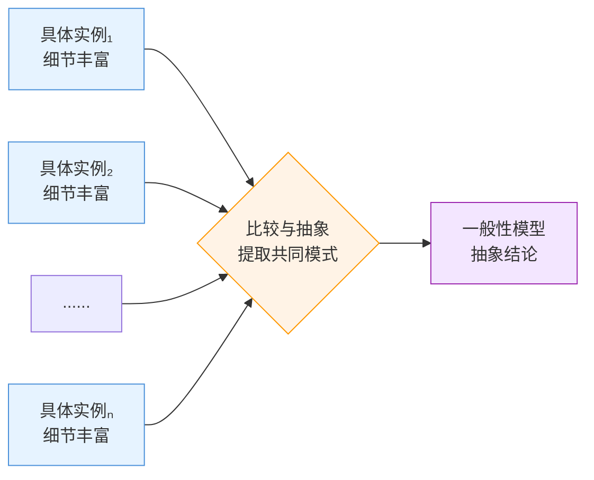

# 归纳

## 定义

归纳是从多个**具体实例**中观察并提取共同模式，形成**一般性结论**的逻辑过程。与演绎不同，归纳的结论是或然的——新出现的实例可能修正甚至推翻原有的结论。

```
┌─────────────────────────────────────────────────────────┐
│                    归纳 = 具体 → 抽象                      │
│                                                         │
│   具体实例₁ ──┐                                          │
│   具体实例₂ ──┼──→ 比较异同 ──→ 抽象共性 ──→ 一般性模型    │
│   具体实例ₙ ──┘     (观察)      (提炼)      (结论)         │
│                                                         │
│   信息量：  高 ────────────────→ 低                       │
│   确定性：  低（或然）─────────→ 高（但可被修正）          │
└─────────────────────────────────────────────────────────┘
```



### 核心特征

| 维度 | 说明 |
|:---|:---|
| 方向 | 特殊 → 一般 |
| 结论性质 | 或然性（可被新实例修正） |
| 典型应用 | 从经验中学习、从数据中发现规律、模式识别 |
| 风险 | 以偏概全、过度拟合、幸存者偏差 |

## 别名

- **英文名：** Induction / Inductive Reasoning
- **也叫作：** 从特殊到一般、归纳推理、模式提取
- **不要混淆：** 与"举例"不同，举例子是用一个具体来说明一般，但归纳需要多个实例才能形成可靠结论

## 适配器

去了三家川菜馆都发现用了花椒→"川菜好像都放花椒"——这就是归纳：从多个具体实例中提取共性。但要注意：第四家可能就不放，归纳的结论是"或然的"，不是铁律。

**下次遇到这类情况会触发：**
- 连续遇到几个相似案例后产生"规律"的感觉→"我在做归纳，但这个规律可靠吗？"
- 看到网上说"90%的用户都……"→"这是归纳结论——样本够吗？有没有幸存者偏差？"
- 面试官说"请举几个例子说明这个模式"→"他在提供实例让我做归纳"

**一句话记住：** 归纳就是"见多了，找出规律"——但规律随时可能被下一个反例推翻。
## 与其他概念的关系

- 属于**[[抽象化]]**——归纳是抽象化的一种具体形式
