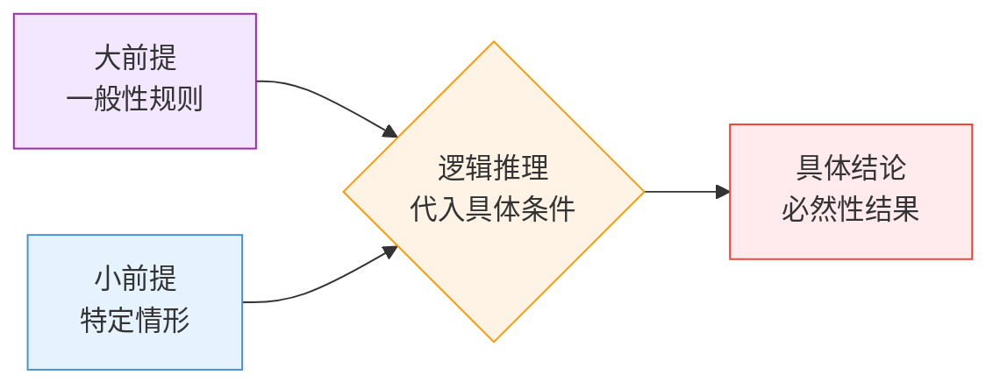

# 演绎

## 定义

演绎是从**一般性前提**出发，结合**具体条件**，通过逻辑推理得到**必然性结论**的过程。与归纳不同，只要前提为真且推理形式有效，结论必然为真。

```
┌─────────────────────────────────────────────────────────┐
│                   演绎 = 抽象 → 具体                      │
│                                                         │
│   大前提（一般性规则/模型）  ──┐                           │
│                              ├──→ 逻辑推理 ──→ 具体结论    │
│   小前提（特定情形/条件）  ──┘       (代入)      (必然)    │
│                                                         │
│   抽象层次：高 ────────────────→ 低                       │
│   确定性：高（必然）──────────→ 高（保真传递）             │
└─────────────────────────────────────────────────────────┘
```



### 核心特征

| 维度 | 说明 |
|:---|:---|
| 方向 | 一般 → 特殊 |
| 结论性质 | 必然性（前提真 + 推理有效 = 结论真） |
| 典型应用 | 根据定理推导具体结果、基于规则做出预测、数学证明 |
| 风险 | 前提错误则全盘皆输（无效输入 → 无效输出） |

## 别名

- **英文名：** Deduction / Deductive Reasoning
- **也叫作：** 从一般到特殊、演绎推理

## 适配器

经典三段论：所有人都会死（大前提），苏格拉底是人（小前提）→ 苏格拉底会死（结论）。只要前提为真且推理有效，结论必然成立。这就是演绎——从一般规则推出具体结论。

**下次遇到这类情况会触发：**
- 用已知规则推断新情况时→"我在做演绎推理"
- 代码里 `if (条件) → 执行分支`→每个if语句本质上都是演绎
- 看到法律条文应用到具体案件→"大前提是法律，小前提是事实，结论是判决"
- 跟人争论时，对方说"因为……所以……"→"这是演绎推理，前提可靠吗？"

**一句话记住：** 演绎就是"规则 + 条件 → 必然结论"，像数学公式一样确定。

