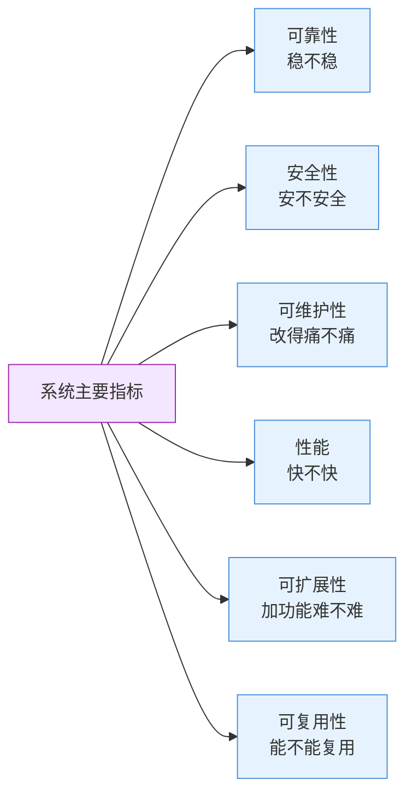

# 系统主要指标

## 定义

系统是由一组相互关联的组件构成、对外提供完整能力的整体。衡量一个系统"好不好"可以从六个核心指标来看——**可靠性、安全性、可维护性、性能、可扩展性、可复用性**，六个维度共同构成了系统质量的完整画像。缺任何一个维度，对系统质量的评估就不完整。

```
┌────────────────────────────────────────────────────────────────────┐
│                        系统主要指标                              │
│                                                                     │
│  ┌────────┐ ┌────────┐ ┌────────┐ ┌────────┐ ┌────────┐ ┌────────┐│
│  │ 可靠性  │ │ 安全性  │ │可维护性 │ │  性能   │ │可扩展性 │ │可复用性 ││
│  │ 稳不稳  │ │安不安全 │ │改得痛否 │ │快不快   │ │加功能难 │ │能用多次 ││
│  └────────┘ └────────┘ └────────┘ └────────┘ └────────┘ └────────┘│
│                                                                     │
│          系统质量 = 六指标的综合表现，缺一不可                        │
└────────────────────────────────────────────────────────────────────┘
```



### 核心特征

| 维度 | 说明 |
|:---|:---|
| 分解方式 | 可靠性 + 安全性 + 可维护性 + 性能 + 可扩展性 + 可复用性，六维覆盖 |
| 完整度 | 缺任意一个维度，对系统的评估就不完整 |
| 用途 | 架构评审、技术选型、设计评估、技术债分析、方案比较 |

> **不要混淆：** 系统的六属性 ≠ 系统的功能。功能是"能做什么"，质量属性是"做得怎么样"。一个能做所有功能的系统如果总宕机，也等于零。

---

## 属性一：可靠性（Reliability）

**系统稳不稳——出不出故障？出故障了能不能自己恢复？**

可靠性衡量系统在给定条件下持续正确运行的能力。它不是"不出错"，而是"出错后能否预期地恢复"。

| 方面 | 说明 |
|:---|:---|
| 容错 | 部分组件挂了不影响整体（如微服务多实例） |
| 恢复 | 挂了之后能不能自动/手动恢复（自愈、重启策略） |
| 数据一致性 | 崩溃后数据会不会丢、会不会错 |
| 预期行为 | 异常时是优雅降级还是直接崩溃 |

**不要混淆：** 可靠性 ≠ 可用性——可靠性是"不出错的能力"，可用性(Availability)是"能用多久的百分比"（通常用 SLA 的 9 衡量）。一个系统可能很可靠（很少出错）但可用性低（维护窗口很长）；也可能可用性高（一直在跑）但不可靠（经常返回错误结果）。

详见独立概念笔记：[[可靠性]]

**适配器：** 凌晨三点被报警电话吵醒——那一刻你关心不是性能也不是扩展性，就一件事：系统能不能赶紧恢复。这就是可靠性在最糟糕的时候展现的价值。

---

## 属性二：安全性（Security）

**系统安不安全——不被攻破、数据不被泄露、操作不被越权。**

安全性关注的是系统在恶意环境下的防御能力，包括防止外部攻击和内部越权。

| 方面 | 说明 |
|:---|:---|
| 认证 | 你是谁？（登录、OAuth、SSO） |
| 授权 | 你能做什么？（RBAC、权限校验） |
| 加密 | 数据在传输和存储中是否安全（TLS、国密、加密存储） |
| 审计 | 谁在什么时候做了什么（操作日志、溯源） |
| 纵深防御 | 单点被突破后还有没有其他防线 |

**不要混淆：** 安全性 ≠ 功能权限——功能权限是"普通用户不能用管理功能"，安全性是"即使用户是管理员，也要验证他的操作是否合法"。安全的系统假设"总有人的账号会被盗"。

**适配器：** 一个用户登录后看到了别人的订单——那一刻安全崩了。安全性平时看不见，出事了就是大新闻。

详见独立概念笔记：[[安全性]]

---

## 属性三：可维护性（Maintainability）

**改起来痛不痛——加个字段要改几个文件？新人第一周能不能上手改代码？**

可维护性衡量系统在接受变更时的成本和风险。它是系统长期健康的核心指标——大多数系统的寿命中，维护成本远高于初始开发成本。

| 方面 | 说明 |
|:---|:---|
| 模块化 | 改动是否局部化（高内聚低耦合） |
| 可读性 | 代码和文档是否清晰易读 |
| 一致性 | 同样的事是否有同样的做法（统一风格、统一模式） |
| 可调试性 | 出问题了能不能快速定位（日志、监控、链路追踪） |

**不要混淆：** 可维护性 ≠ 代码整洁——代码整洁是可维护性的子集。可维护性还包括模块划分、文档质量、构建部署流程等。一个人的整洁代码可能是另一个人的灾难（比如过度抽象）。

**适配器：** 加一个字段要改 10 个文件而且你还得想半天"哪 10 个"——这就是可维护性差的现场。好的可维护性是："加这个字段？哦，改这一个地方就行。"

---

## 属性四：性能（Performance）

**系统快不快——响应时间、吞吐量、资源消耗是否在预期范围内。**

性能衡量系统在给定资源下能多快、多大量地处理请求。性能问题通常是"没那么致命但用户最敏感"的问题。

| 方面 | 说明 |
|:---|:---|
| 响应时间 | 一个请求从发起到返回需要多久（延迟 Latency） |
| 吞吐量 | 单位时间能处理多少请求（TPS/QPS） |
| 资源效率 | 用多少 CPU/内存/带宽能干多少活 |
| 可预测性 | 性能是否稳定（99% 的请求都在 200ms 以内，还是有长尾） |

**不要混淆：** 性能 ≠ 可扩展性——性能是"现在跑多快"，可扩展性是"加机器能不能跑更快"。一个单机性能很好的系统可能完全不可扩展（加机器反而变慢）。

**适配器：** 点一个按钮转了三圈才反应过来——这就是性能问题。用户不会管"是不是网络问题"，他们只知道"这系统真慢"。

详见独立概念笔记：[[性能]]

---

## 属性五：可扩展性（Scalability）

**加功能难不难——新需求来了，系统架构能扛得住吗？**

可扩展性有两个含义：一是**功能上**能不能容易地加新功能（系统的开放性），二是**负载上**能不能通过加资源来应对更大流量（横向扩展能力）。

| 方面 | 说明 |
|:---|:---|
| 功能扩展 | 加一个新业务功能需要改多少地方 |
| 负载扩展 | 用户量翻倍，加几台机器能扛住 |
| 扩展方式 | 是加机器就能线性扩展，还是有瓶颈（如数据库成为单点） |
| 增量成本 | 每扩展一单位付出的代价是否递增 |

**不要混淆：** 可扩展性 ≠ 可维护性——可扩展性是"加新东西方不方便"，可维护性是"改现有东西方不方便"。两者经常一起出现但独立的：一个插件化系统（高可扩展）但如果插件接口设计得烂（低可维护），照样痛苦。

**适配器：** 双十一流量翻了三倍，系统挂了——这是可扩展性崩了。好的可扩展性是：流量翻倍 → 加两台机器 → 继续正常跑，像没发生过一样。

---

## 属性六：可复用性（Reusability）

**能不能被其他地方用——这个模块在其他项目能不能直接用？**

可复用性衡量系统组件脱离当前上下文被其他地方利用的程度。它不是必须的（很多系统不需要），但一旦你需要，没有就非常痛苦。

| 方面 | 说明 |
|:---|:---|
| 接口抽象 | 组件是否通过接口暴露能力而非通过实现 |
| 上下文依赖 | 组件对外部环境的依赖是否明确（配置化、依赖注入） |
| 通用性 | 此功能是否只为一个场景设计（定制化 vs 通用化） |
| 复用粒度 | 是代码级复用（函数/类）、组件级复用（库/SDK）还是服务级复用（API） |

**不要混淆：** 可复用性 ≠ 不要重复(DRY)——DRY 是"同个代码库里不要有重复代码"，可复用性是"这个模块能拿到另一个项目里直接用"。过度追求可复用性会导致过度抽象，你还没复用就已经被复杂度压垮了。

**适配器：** 新项目需要一个"导出Excel"的功能——你能直接从旧项目里把模块拷贝过来，改两行配置就用上了，不需要重写。这就是可复用性好。反过来，旧项目里有个导出功能但跟业务逻辑死死耦合在一起，拆不出来——可复用性差。

---

## 六个属性的关系

六个属性相互独立又相互影响：

- [[可靠性]] 和 [[性能]] 经常冲突——加缓存提升性能但降低了可靠性（缓存可能不一致）
- [[安全性]] 和 [[性能]] 天然对立——加密、审计都在拖慢系统
- [[可维护性]] 和 [[可扩展性]] 互相促进——模块化做得好，两者都受益
- [[安全性]] 影响所有维度——不够安全的系统，其他属性再好也没用

**缺一不可检验：** 评估一个系统时，逐项问六个问题——稳不稳？安不安全？改起来痛不痛？快不快？加功能难不难？能复用吗？——漏掉任何一个，评估就不完整。

---

## 适配器

"系统"不是一个抽象词——它就等于你面前的软件/产品/代码库的全部质量表现的总和。

**用具体事件来判断系统好坏：**

| 事件 | 命中哪个属性 |
|:---|:---|
| 凌晨被报警吵醒 | 可靠性 |
| 用户数据泄露 | 安全性 |
| 改个文案要部署半小时 | 可维护性 |
| 用户说"这系统真慢" | 性能 |
| 双十一挂了 | 可扩展性 |
| 新项目又要写一遍导出Excel | 可复用性 |

**下次遇到这类情况会触发：**
- 面试被问"你怎么评价一个系统的设计"→"从六个维度拆：稳定性、安全性、可维护性、性能、扩展性、复用性"
- 做技术选型时拿不定主意→"按六个维度列个打分表，看哪个方案总分最高"
- 接手一个遗留系统时→"先不要改代码，按六个维度摸一遍，找到最痛的点"
- 架构评审时被挑战"这个方案好在哪里"→"从六个维度说明收益，哪个维度提升了、哪个维度牺牲了"

**一句话记住：** 评价一个系统不是看它"能做什么"，是看它**"做得怎么样"**——六属性就是"做得怎么样"的拆解。
