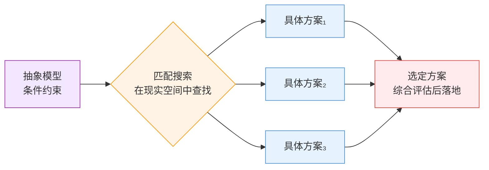

# 设计

## 定义

设计是以抽象模型作为**条件约束**，在现实空间中**查找匹配**的具体方案的过程。设计的匹配过程通常不唯一——同一组约束可能对应多个可行的具体方案，需要根据实际情况选择。

```
┌─────────────────────────────────────────────────────────┐
│              设计 = 约束 → 匹配 → 具体方案                │
│                                                         │
│   抽象模型（条件约束） ──→ 搜索/匹配 ──→ 具体设计方案       │
│                          (空间)      (选择)               │
│                                                         │
│   抽象层次：高 ────────────────→ 低                       │
│   确定性：低（多个方案可选）───→ 高（选定后落地）          │
└─────────────────────────────────────────────────────────┘
```



### 核心特征

| 维度 | 说明 |
|:---|:---|
| 方向 | 抽象 → 具体 |
| 过程性质 | 约束匹配（非唯一解，需决策） |
| 输入 | 抽象模型（作为约束/条件） |
| 输出 | 匹配到的具体方案 |
| 典型活动 | 根据功能需求设计产品、根据建筑规范设计房屋 |

## 别名

- **英文名：** Design
- **也叫作：** 约束匹配、方案设计
- **不要混淆：** 与"艺术创作"不同——设计是从约束出发的方案匹配，不是自由表达。设计属于[[具体化]]，它的输入（抽象模型）往往来源于[[抽象化]]的成果

## 适配器

装修时你要选一个沙发——客厅只有3米宽（约束）、要能躺人（功能）、预算不超3000（又一个约束）、要搭配灰色地板（环境）——在这么多条件限制下找到匹配的方案，这就是设计。不是自由创作，是在约束空间里做选择。

**下次遇到这类情况会触发：**
- 面对一个需求，脑子开始列出各种限制条件→"现在进入设计模式了"
- 方案评审时有人说"这个方案好，但那个方案也行"→"设计就是多解问题，需要在多个可行方案中决策"
- 发现某个方案很漂亮但不符合约束→"这不是好设计，好设计要先满足约束"
- 看到一把设计精良的椅子→"它在满足'坐着舒服、站得稳、成本低、好看'这些约束中找到了平衡"

**一句话记住：** 设计就是"戴着镣铐跳舞"——约束不是敌人，是设计的起点。

## 与其他概念的关系

- 属于**[[具体化]]**——设计是具体化的一种具体形式
- 设计的输入（抽象模型）往往来源于**[[抽象化]]**（如[[归纳]]）的成果
- 与[[归纳]]方向相反——归纳是具体→抽象，设计是抽象→具体
- 设计文档的分层表达方法详见 [[方法/分层设计法]]
