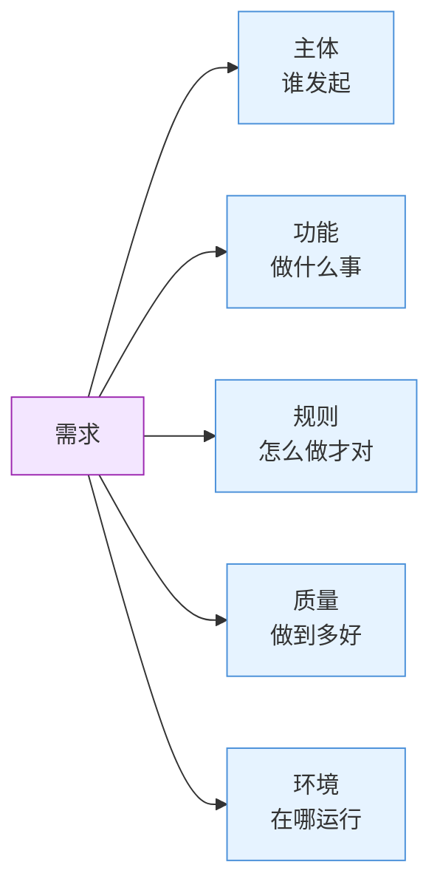

# 需求

## 定义

需求是对一个系统或产品应当具备的能力、行为或属性的描述。一个完整的需求可以分解为五个核心属性——**主体、功能、规则、质量、环境**，五个维度共同构成需求的完整画像，缺一则不完整。

```
┌─────────────────────────────────────────────────────────┐
│                   需求 = 五属性分解                        │
│                                                         │
│   ┌────────┐  ┌────────┐  ┌────────┐  ┌────────┐  ┌───┐│
│   │  主体   │  │  功能   │  │  规则   │  │  质量   │  │环境││
│   │ (谁)    │  │(做什么) │  │(怎么做) │  │(多好)   │  │(哪)││
│   └────────┘  └────────┘  └────────┘  └────────┘  └───┘│
│                                                         │
│   一个完整的需求 = 主体 + 功能 + 规则 + 质量 + 环境         │
└─────────────────────────────────────────────────────────┘
```



### 核心特征

| 维度 | 说明 |
|:---|:---|
| 分解方式 | 主体+功能+规则+质量+环境，五维覆盖 |
| 完整度 | 缺任意一个属性，需求就不完整、无法执行 |
| 用途 | 需求分析、产品定义、任务拆分、验收标准 |

---

## 属性一：主体（Who）

**谁发起？谁执行？** 主体决定了需求的权限范围、数据可见性和操作边界。

| 常见类型 | 示例 |
|:---|:---|
| 普通用户 | 下单、查物流 |
| VIP 用户 | 走快速通道、享受折扣 |
| 管理员 | 查看所有订单、删除评论 |
| 外部系统 | 支付回调通知、第三方数据同步 |

**不要混淆：** 主体≠用户——一个用户可能扮演多个主体角色（如既是普通用户又是管理员），主体是"角色"而非"人"。

**适配器：** 电商下单——普通用户下单需要支付；VIP用户下单走快速通道，享受折扣。同样的"下单"功能，主体不同，规则就不同。

---

## 属性二：功能（What）

**做什么事？** 功能是系统对外提供的可观测、可验证的行为——用户能完成什么操作、系统能响应什么事件。

| 特点 | 说明 |
|:---|:---|
| 粒度 | 应拆到原子级别（"创建订单"而非"订单管理"） |
| 可验证性 | 每个功能应有明确的验收标准 |
| 独立性 | 功能相互正交，避免重叠 |

**不要混淆：** 功能≠实现方式——"导出报表"是功能，"用POI生成Excel"是实现方式。

**适配器：** API设计——每个REST API端点本质上就是一个功能：`POST /orders`＝创建订单的功能。API文档就是对功能的精确描述。

---

## 属性三：规则（How约束）

**怎么做才对？** 规则决定功能的执行路径和边界条件——什么条件下允许做、什么条件下禁止做、什么条件下走分支A而不是分支B。规则是需求中最常变化、最容易产生歧义的部分。

| 特点 | 说明 |
|:---|:---|
| 性质 | 条件判断（if-then-else），不是操作流程 |
| 变化频率 | 高——业务策略调整通常就是改规则 |
| 常见来源 | 合规要求、业务策略、权限控制、校验逻辑 |

**不要混淆：** 规则≠功能——功能是"做什么"，规则是"怎么做才对"。

**适配器：** "满200减30，但不能与VIP折扣叠加"——这是两条规则。它们不描述"下单"这个功能本身，而是约束了下单时的行为路径。

---

## 属性四：质量（How好）

**做到多快、多稳、多安全？** 质量属性是功能的"品质标准"，决定了用户对系统的体验感受。

| 类别 | 示例 |
|:---|:---|
| 性能 | 响应时间<200ms、支持 1000 并发 |
| 安全 | 密码使用SM3国密加密、传输使用TLS1.3 |
| 可用性 | 系统可用性 99.9%、支持自动故障转移 |
| 可维护性 | 日志完整保留 90 天、支持热更新 |

质量好坏的衡量详见 [[质量]]。**核心原则：** 不可量化的质量要求无法验收（"快"→"<200ms"）。

**不要混淆：** 质量≠功能——功能是"能不能做"，质量是"做得好不好"。

**适配器：** "下单接口必须在200ms内返回"——这是质量标准。没有这个要求，功能也能跑，但用户会抱怨"太慢了"。质量决定了实际体验。

---

## 属性五：环境（Where）

**跑在哪儿？** 环境决定了技术选型、部署方式和可用资源。

| 类别 | 示例 |
|:---|:---|
| 网络 | 内网、公网、混合云、专线 |
| 硬件 | x86、ARM（鲲鹏/飞腾）、GPU |
| 操作系统 | Windows、Linux、银河麒麟 |
| 部署模式 | 单机、集群、边缘计算、SaaS |

**不要混淆：** 环境≠基础设施——环境是"在哪儿跑"的需求描述，不是具体的服务器配置。

**适配器：** 国产化替代——系统需要部署在国产化芯片（如鲲鹏、飞腾）上，操作系统使用银河麒麟。它不改变功能逻辑，但直接决定了技术栈。

---

## 五个属性的关系

各属性相互独立又相互影响：

- [[主体]]决定[[功能]]的权限范围
- [[规则]]约束[[功能]]的执行路径
- [[质量]]定义[[功能]]的性能标准
- [[环境]]限定[[功能]]的运行边界，同时影响[[规则]]（不同环境不同安全策略）和[[质量]]（网络环境不同，响应要求也不同）

**缺一不可检验：** 拿到一个需求描述，逐项问五个问题——谁？做什么？怎么做才对？多好？在哪儿？——漏掉任何一个，需求就不完整。

## 适配器

"需求"不光是产品经理的事——你的欲望、被分配的任务、日常要做的事，本质上都是需求。

**欲望就是需求：** 你突然很想喝奶茶 → 主体是你，功能是"喝到奶茶"，规则是"三分糖少冰"，质量是"半小时内喝到"，环境是"公司附近"。用五问一套，欲望立刻变成了可执行的需求——你打开外卖App下单了。

**任务就是需求：** 老板说"把这个报表整理一下" → 主体是你，功能是"整理报表"，规则是"按上个月的格式"，质量是"下班前交"，环境是"用公司电脑"。任务的本质就是被分配的需求。

**需求五问——通用版：**

1. **谁**的？（主体）
2. 要**什么**？（功能）
3. 有啥**条件**？（规则）
4. 做到**多好**？（质量）
5. 在哪儿/**用什么**？（环境）

就像点菜：谁吃？吃什么？有啥忌口？几分饱？在哪吃？缺一个都点不明白。

**下次遇到这类情况会触发：**
- 心里冒出一个欲望（想吃/想买/想去哪）→"这是需求！用五问把它具象化，别让欲望停留在模糊状态"
- 老板/别人交代你一件事→"这个需求完整吗？五问缺了哪些？"
- 给自己列待办清单时→"每条任务都是一个需求，问问自己：主体是我吗？做得多好算完？"
- 产品经理扔过来一句话需求时→"亮出五问，把一句话拆成五个维度"
- 写技术方案写到一半发现漏了边界条件→"回头查一下五问哪一问漏了"
- 跟团队扯皮"这个需求到底算不算完整"→"用五问逐个打勾"
- 评审时别人问了一个你没想到的问题→"刚才五问中漏了哪一问？"
