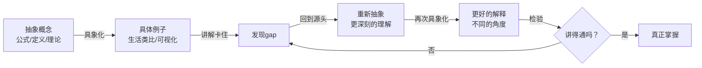

---
tags:
  - 方法
  - 复杂涌现
aliases:
  - 费曼学习法
  - Feynman Technique
created: 2026-06-25
---

# 费曼学习法

## 核心思想
**以教代学** — 通过向别人解释来检验和深化自己的理解。

## 四个步骤

1. **选择一个概念**
   - 选定一个你想要学习的概念或知识点

2. **教给别人**
   - 用最简单的语言把这个概念讲给一个完全不懂的人听
   - 避免使用专业术语，用大白话解释

3. **发现 gaps**
   - 在讲解过程中卡住、说不清的地方，就是你理解的薄弱环节
   - 回到原始材料重新学习，直到能流畅解释

4. **简化与类比**
   - 用生活中的类比或比喻来加深理解
   - 让解释更直观、更易记

## 原则

- 如果你不能简单地把它说清楚，说明你还没有真正理解它
- 真正的理解 = 能用简单的语言解释复杂的事物
- 教是最好的学

## 适用场景

- 学习新知识（编程、数学、科学等）
- 复习巩固已有知识
- 准备教学或分享内容
- 排查自己是否真正理解某个概念

---

## 深度分析：费曼循环与抽象具象螺旋

### 本质 — 不是单向输出，而是闭环循环

费曼学习法的核心不是一个 "学→教" 的线性过程，而是一个 **"理解 → 解释 → 发现gap → 重构理解 → 再解释"** 的闭环循环。每次循环都是一次认知升级。

### 抽象 ↔ 具象 螺旋上升

在这个循环中，学习者不停地在两端之间切换：



- **[[抽象化]]** — 提炼出核心原理、公式、规律
- **[[具体化]]** — 用现实世界的例子、类比、故事来阐释
- **[[归纳]]** — 从多个例子中归纳共性 → [[抽象化]]
- **[[演绎]]** — 从抽象原理推导到具体应用 → [[具体化]]

### 需要多维度、多工具的具象化

一个抽象概念很难用一种解释方式讲透，需要从不同角度切入：

| 维度 | 表达工具 | 作用 |
|------|---------|------|
| **时序维度** | [[时序图]] | 展示过程、步骤、先后关系 |
| **结构维度** | [[架构图]] | 展示组成部分和层级关系 |
| **流程维度** | [[流程图]] | 展示逻辑分支、决策路径 |
| **状态维度** | [[状态图]] | 展示不同状态间的转换 |
| **类比维度** | 生活比喻 | 把陌生的比作熟悉的 |

> 同一概念用多种工具表达，就是在多个维度上反复进行 **抽象→具象** 的切换，从而构建出立体的理解。

### 背后的认知科学

#### 1. 学习金字塔（Cone of Learning）

| 学习方式 | 平均 retention |
|---------|:------------:|
| 讲授（被动听） | 5% |
| 阅读 | 10% |
| 视听结合 | 20% |
| 演示 | 30% |
| 讨论 | 50% |
| 实践 | 75% |
| **教别人 / 立即使用** | **90%** |

费曼学习法落在金字塔的最底层 — 教授他人是 retention 最高的学习方式，因为它强迫你主动组织知识、填补gap、重构理解。

#### 2. 艾宾浩斯遗忘曲线（Ebbinghaus Forgetting Curve）

- 新学知识 20 分钟后遗忘 42%，1 小时后遗忘 56%
- 费曼学习法的每次 "教别人" 都是一次 **主动回忆（Active Recall）**
- 每发现一个 gap 并修复，就等于在遗忘曲线上打了一个 **加固钉**
- 循环次数越多，记忆曲线越平缓，知识越牢固

### 总结

费曼学习法不是一个技巧，而是一套 **元认知引擎**：

```
教 → 暴露gap → 多维度具象化 → 重新抽象 → 再教
         ↑_______________循环_______________↓
```

它驱动你在 [[抽象化]] 与 [[具体化]] 之间不断切换，配合 [[归纳]] 和 [[演绎]] 两种推理，借用多种表达工具（图表、类比、故事），最终让你对知识的理解达到 **既深刻又灵活** 的地步 — 既能抽象出本质，又能用最简单的语言讲给任何人听。
